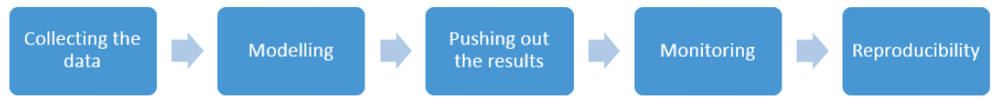

```{r setup, include=FALSE}
knitr::opts_chunk$set(echo = FALSE)
```

```{r, include=FALSE}
htmltools::tagList(rmarkdown::html_dependency_font_awesome())
library(knitr)
opts_chunk$set(
  comment = "",
  fig.width = 10, 
  message = FALSE,
  warning = FALSE,
  tidy.opts = list(
    keep.blank.line = TRUE, 
    width.cutoff = 150
  ),
  options(width = 200),
  eval = TRUE,
  echo = TRUE,
  cache = TRUE
)
```

# The process of creating an application {data-background="imgs/bg-small.png"}

## Workflow {data-background="imgs/bg-small.png"}



# Collecting the data from Elasticsearch {data-background="imgs/bg-small.png"}

## What is Elasticsearch? {data-background="imgs/bg-small.png"}

> [Elasticsearch is a search engine based on Lucene. It provides a distributed, multitenant-capable full-text search engine with an HTTP web interface and schema-free JSON documents.</small>](https://en.wikipedia.org/wiki/Elasticsearch)

## <small>[`elastic`](https://cran.r-project.org/web/packages/elastic/index.html) package</small> {data-background="imgs/bg-small.png"}

```{r, results = 'hide'}
library('elastic')
connect(url = 'http://127.0.0.1', es_port = 9200)
```

```{r}
body <- '{
  "query" : {
    "filtered" : {
      "filter" : {
        "and" : {
          "filters" : [ {
            "range" : {
              "Sepal_Length" : { "from" : 0, "to" : 6 }
            }
          } ]
        }}}}
}'
iris_data <- Search(index = "iris", body = body, asdf = TRUE, size = 200)$hits$hits$`_source`
```
More about the Elastic queries [here](https://www.elastic.co/guide/en/elasticsearch/reference/current/query-dsl.html).

## <small>[`elastic`](https://cran.r-project.org/web/packages/elastic/index.html) package</small> {data-background="imgs/bg-small.png"}

```{r}
iris_data <- Search(index = "iris", body = body, asdf = TRUE, size = 200)$hits$hits$`_source`
head(iris_data)
nrow(iris_data)
```

# Preparing the model {data-background="imgs/bg-small.png"}

## <small>Classification tree</small> {data-background="imgs/bg-small.png"}

```{r, fig.height = 4}
library(rpart)
fit <- rpart(Species ~ ., data = iris_data)
rattle::fancyRpartPlot(fit)
```

# Pushing out the results {data-background="imgs/bg-small.png"}

## <small>What is Kafka?</small> {data-background="imgs/bg-small.png"}

> [Kafka is a distributed streaming platform. 
It gets used for two broad classes of application:](http://kafka.apache.org/documentation.html)

1. Building real-time streaming data pipelines that reliably get data between systems or applications.
2. Building real-time streaming applications that transform or react to the streams of data.


## <small>`rkafka` package</small> {data-background="imgs/bg-small.png"}

```{r,echo=FALSE}
rules <- '"setosa":{"Petal_Length<2.45"},"virginica":{"Petal_Length>=2.45","Petal_Width>=1.65"},"versicolor":{"Petal_Length>=2.45","Petal_Width<1.65"}'
```

```{r}
cat(msg <- paste0('{"sendDate":"', Sys.time(),'","model":{',rules, "}"))
```
```{r, eval=FALSE}
library(rkafka)
producer <- rkafka.createProducer("127.0.0.1:9092")
rkafka.send(producer, 
            topicName = "irisModel",
            ip = "irisModel",
            message = msg)
rkafka.closeProducer(producer)
```

# Monitoring  {data-background="imgs/bg-small.png"}

## <small>What is Zabbix?</small> {data-background="imgs/bg-small.png"}

>[Zabbix is the ultimate enterprise-level software designed for real-time monitoring of millions of metrics collected from tens of thousands of servers, virtual machines and network devices.](http://www.zabbix.com/)


## <small>Combining Zabbix with R</small> {data-background="imgs/bg-small.png"}

```{r, eval = FALSE}
system2("zabbix_sender", args = c(
  '-z', 'server.zabbix.com', # Zabbix server host
  '-s', 'serverofmyapp.com', # technical name of monitored host
  '-k', 'iris_model_monitoring', # item key
  '-o', 'status of my app' )) # value to send
```

Also: [`RZabbix`](https://cran.r-project.org/web/packages/RZabbix/index.html) package.

# Reproducibility of the application {data-background="imgs/bg-small.png"}

## <small>Docker</small> {data-background="imgs/bg-small.png"}

#### Package your application into a standardized unit for software development

> [Docker containers wrap a piece of software in a complete filesystem that contains everything needed to run: code, runtime, system tools, system libraries – anything that can be installed on a server. This guarantees that the software will always run the same, regardless of its environment.](https://www.docker.com/what-docker)

## <small>How to use docker?</small> {data-background="imgs/bg-small.png"}

```bash
FROM rocker/r-base

RUN R -e "install.packages(c('elastic', 'rpart', 'rattle', 'stringi', 'rkafka', 'RZabbix'), 
                repos='https://cran.rstudio.com/')"
RUN apt-get install -y zabbix-sender

RUN mkdir -p app/Rscripts

ADD Rscripts /app/Rscripts

ADD run.R /app/
WORKDIR /app
CMD R -f /app/run.R
```

# Thank you for your attention! {data-background="imgs/bg-small.png"}


